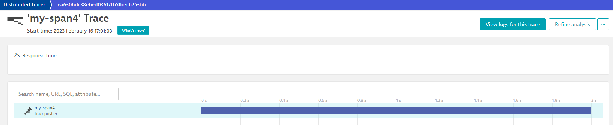

# OpenTelemetry tracepusher

## [> View the tracepusher documentation <](https://agardnerit.github.io/tracepusher)

Generate and push OpenTelemetry Trace data to an endpoint in JSON format.




# Watch: tracepusher in Action
[YouTube: tracepusher tracing a GitLab pipeline](https://www.youtube.com/watch?v=zZDFQNHepyI).

If you like tracepusher and want to do the same thing with logs, check out [logpusher](https://agardnerit.github.io/logpusher).

# Uses

- [Trace CICD Pipelines with OpenTelemetry](samples/gitlab/README.md)
- [Trace shell scripts with OpenTelemetry](samples/script.sh)
- Trace anything with OpenTelemetry!

# Try In Browser

See [try tracepusher in-browser without installation](https://agardnerit.github.io/tracepusher/try/).

## Python3 Usage

See [use tracepusher as a Python script](https://agardnerit.github.io/tracepusher/usage/python).


## Docker Usage

See [use tracepusher as a docker image](https://agardnerit.github.io/tracepusher/usage/docker/).

## CI Usage

See [run a CI pipeline step as a docker image with tracepusher](https://agardnerit.github.io/tracepusher/usage/ci).

## Dry Run Mode

See [dry run mode flag](https://agardnerit.github.io/tracepusher/reference/dry-run-mode/).

## Debug Mode

See [debug mode flag](https://agardnerit.github.io/tracepusher/reference/debug-mode/).

## Time Shifting

See [time shifting](https://agardnerit.github.io/tracepusher/reference/time-shifting/).

## Complex Tracing (Sub Span support)

See [multi-span traces](https://agardnerit.github.io/tracepusher/reference/multi-span-traces/).

## Span Attributes

> Only supported with `v0.6.0` and above.

See [span attribute types](https://agardnerit.github.io/tracepusher/reference/span-attribute-types/).

## Span Events

> Only supported with `v0.7.0` and above.

See [span events](https://agardnerit.github.io/tracepusher/reference/span-events/).

## Span Kind

> Only supported with `v0.8.0` and above.

See [span kind](https://agardnerit.github.io/tracepusher/reference/span-kind/)

## Span Duration and Duration Type

tracepusher will generate spans of `n` seconds.

This behaviour can be overridden by using the `--duration-type` parameter.

See [duration type](https://agardnerit.github.io/tracepusher/reference/duration-type/) page.

## Spin up OpenTelemetry Collector

See [OpenTelemetry Collector configuration](https://agardnerit.github.io/tracepusher/reference/otel-col)

# Adopters

Do you use tracepusher? Thanks and we'd love to know!

Submit a PR and add your details to [ADOPTERS.md](ADOPTERS.md)

# FAQs

See [FAQ](https://agardnerit.github.io/tracepusher/faq).

# Breaking Changes

See [Breaking changes](https://agardnerit.github.io/tracepusher/breaking-changes)

# Building

Run all build commands from the root directory:

```
docker buildx build --platform linux/arm64,linux/amd64 --push -t tracepusher:dev-ci -f ./docker/ci/Dockerfile .
docker buildx build --platform linux/arm64,linux/amd64 --push -t tracepusher:dev -f ./docker/standard/Dockerfile .
```

----------------------

# Contributing

All contributions are most welcome!

Get involved:
- Tackle a [good first issue](https://github.com/agardnerIT/tracepusher/issues?q=is%3Aopen+is%3Aissue+label%3A%22good+first+issue%22)
- Create an issue to suggest something new
- File a PR to fix something


<a href="https://github.com/agardnerit/tracepusher/graphs/contributors">
  
</a>

Made with [contrib.rocks](https://contrib.rocks).
