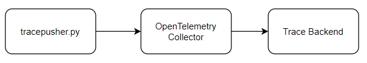

# OpenTelemetry tracepusher

Generate and push OpenTelemetry Trace data to an endpoint in JSON format.

##  Uses

- [Trace CICD Pipelines with OpenTelemetry](samples/gitlab/README.md)
- [Trace shell scripts with OpenTelemetry](samples/script.sh)
- Trace anything with OpenTelemetry!

## Try tracepusher
See [try tracepusher](try.md)

