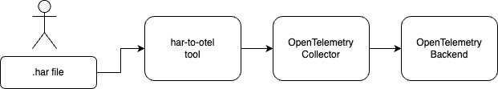

# Chrome DevTools HAR File to OpenTelemetry Converter



This tool converts a `.har` file to OpenTelemetry traces and sends them to an OpenTelemetry collector using tracepusher.

Download this tool from the [tracepusher releases assets on GitHub](https://github.com/agardnerIT/tracepusher/releases).

## Prerequisites

This tool requires either:

- A copy of the `tracepusher` binary >= `v0.10.0` in the `PATH`
- A copy of [tracepusher.py](https://github.com/agardnerIT/tracepusher/blob/main/tracepusher.py) ( >= `v0.10.0`) in the same directory as `har-to-otel`

If you can run `./tracepusher version` and get a version >= `0.10.0`, you're good to proceed.

## Usage

```
./har-to-otel -f /path-to-file/YOUR-HAR-FILE.har -ep http://otel-collector-url:4318 --insecure true
```

### Optional flags

If set, these are added as span attributes:

- `--timings [true|false]` (defaults to `true`)
- `--request-headers [true|false]` (defaults to `false`)
- `--response-headers [true|false]` (defaults to `false`)
- `--request-cookies [true|false]` (defaults to `false`)
- `--response-cookies [true|false]` (defaults to `false`)
- `--debug [true|false]` (defaults to `false`)
- `--dry-run [true|false]` (defaults to `false`)
- `--version` (prints the `har-to-otel` version)