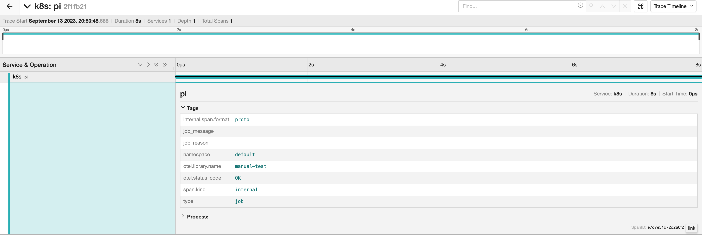

## Trace Kubernetes Jobs and CronJobs with tracepusher



Install the tracepusher job operator to automatically generate OpenTelemetry traces for any `Job` and `CronJobs` on the cluster.

### Prerequisites

First, make sure you have an OpenTelemetry collector running somewhere.

### 1. Install Custom Resource Definitions

Install the tracepusher CRDs:

```shell
kubectl apply -f https://raw.githubusercontent.com/agardnerIT/tracepusher/main/operator/crds.yml
```

### 2. Create One (or more) JobTracer Objects

A `JobTracer` should be created, one per namespace.

This defines the defaults for that namespace.

You can override the details on a per job basis.

```shell
cat <<EOF | kubectl create -f -
---
apiVersion: tracers.tracepusher.github.io/v1
kind: JobTracer
metadata:
  name: tracer
  namespace: default
spec:
  collectorEndpoint: "http://your-collector.namespace.svc.cluster.local:4318"
EOF
```

You can now `kubectl get jobtracers`.

### 3. Create a Job or CronJob

Now create a `Job` or `CronJob` as normal:

```
cat <<EOF | kubectl create -f -
---
apiVersion: batch/v1
kind: Job
metadata:
  name: pi
  namespace: default
  #annotations:
  #  tracepusher/ignore: "true"
  #  tracepusher/collector: "http://example.com:4318"
spec:
  template:
    spec:
      containers:
      - name: pi
        image: perl:5.34.0
        command: ["perl",  "-Mbignum=bpi", "-wle", "print bpi(2000)"]
      restartPolicy: Never
  backoffLimit: 0
EOF
```

Note the optional annotations. If set, these override the `JobTracer` settings.

### Example 2: A Multi Container Job

tracepusher works with multi container jobs too:

```shell
cat <<EOF | kubectl create -f -
---
apiVersion: batch/v1
kind: Job
metadata:
  name: pi-multicontainer
  namespace: default
  #annotations:
  #  tracepusher/ignore: "true"
  #  tracepusher/collector: "http://example.com:4318"
spec:
  template:
    spec:
      containers:
      - name: first
        image: perl:5.34.0
        command: ["perl",  "-Mbignum=bpi", "-wle", "print bpi(2000)"]
      - name: second
        image: perl:5.34.0
        command: ["perl",  "-Mbignum=bpi", "-wle", "print bpi(1000)"]
      restartPolicy: Never
  backoffLimit: 0
EOF
```